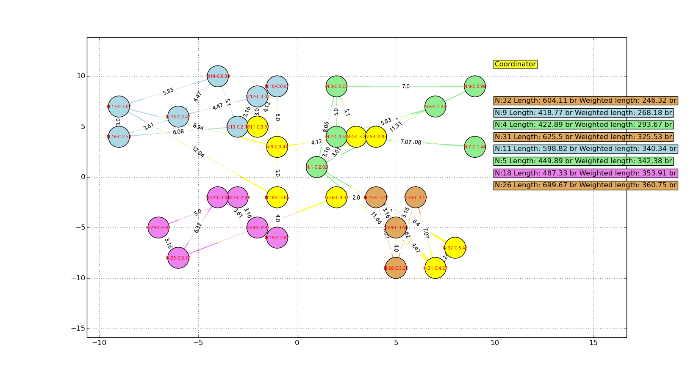
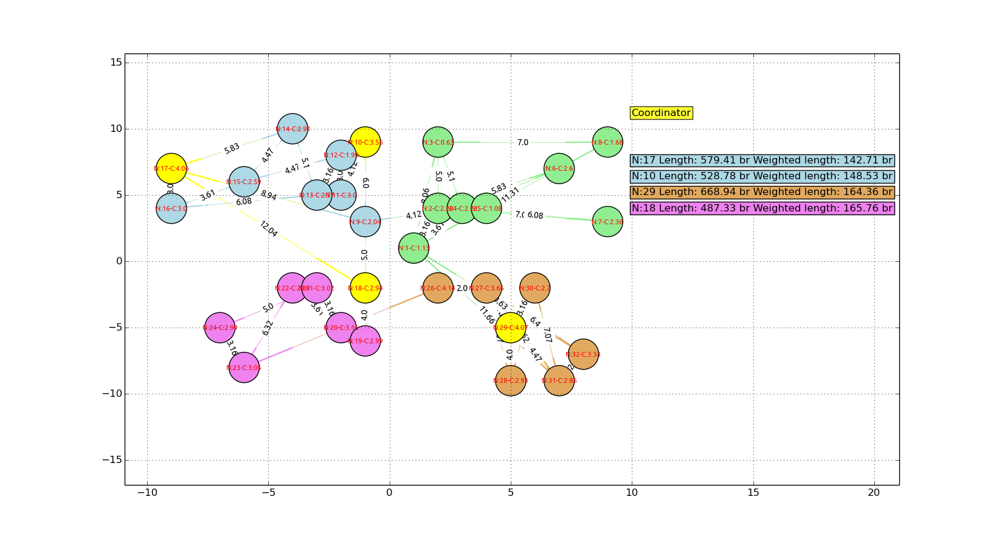
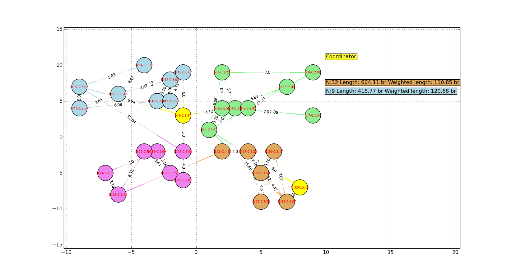

system-simulation
===========
On ubuntu firstly you should install networkx and matplotlib for python

```sudo apt-get install python-pip```

```pip install networkx```

```sudo apt-get install python-matplotlib```
 
Run  
``` python gui.py```

##Examples
 [](https://github.com/ismailakbudak/system-simulation) 
 [](https://github.com/ismailakbudak/system-simulation) 
 [](https://github.com/ismailakbudak/system-simulation)  
 


 
